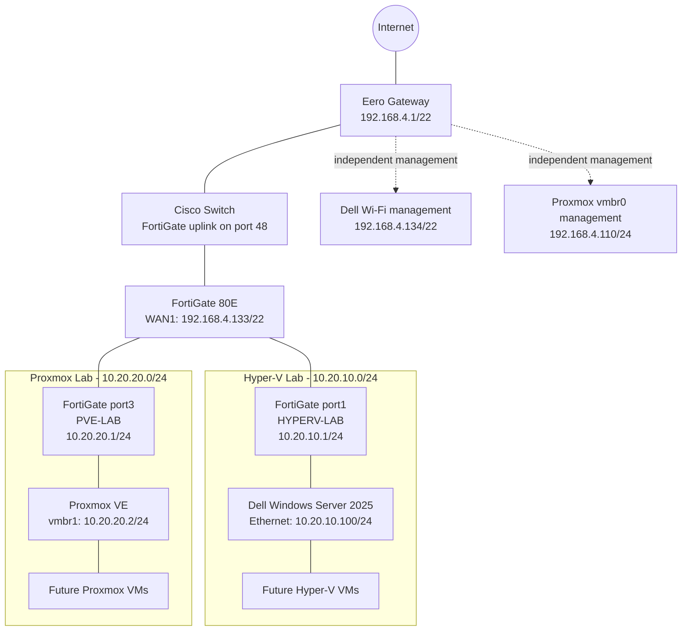
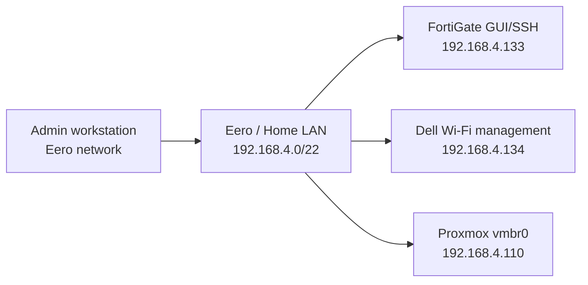
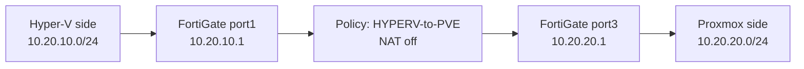
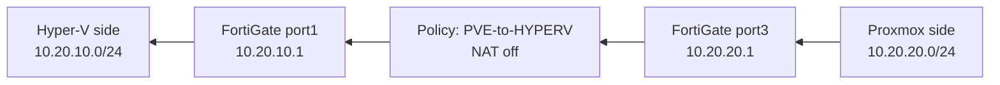
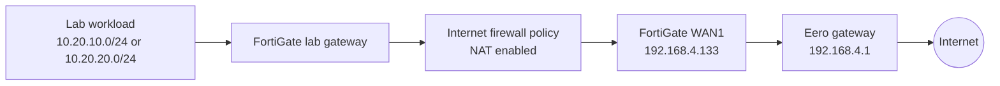
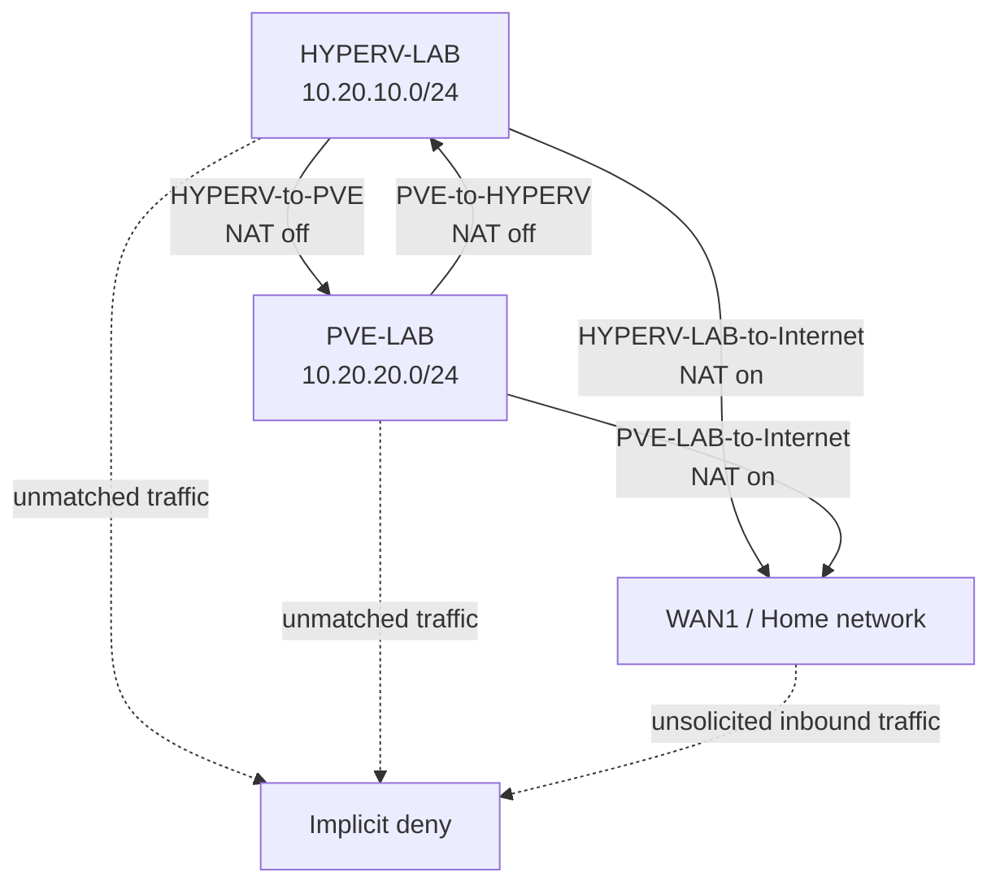

# FortiGate Hybrid Hypervisor Lab

## Overview

This lab introduces a physical FortiGate 80E as the routed security boundary between a Proxmox VE environment and a Windows Server 2025 Hyper-V environment.

The design preserves independent management paths for both hypervisors while routing and inspecting dedicated lab traffic through the FortiGate. It creates a practical mixed-hypervisor environment for learning firewall policy, routing, NAT, DHCP, Linux bridges, Windows routes, and host-level firewall behaviour.

> **Publication note:** The addresses shown in this document are RFC 1918 private addresses and are not Internet-routable. No passwords, public IP addresses, serial numbers, MAC addresses, licence information, configuration backups, or authentication material are included. The topology is therefore suitable for public documentation in its current sanitized form.

## Objectives

- Integrate a physical FortiGate 80E into the existing home network.
- Preserve stable management paths for Proxmox and Hyper-V.
- Create separate routed lab networks for each hypervisor.
- Permit controlled bidirectional communication between the two lab networks.
- Provide NAT-based Internet access for lab workloads through the FortiGate.
- Keep the design suitable for future Active Directory, VLAN, VPN, automation, and security-policy exercises.

## Architecture Summary

The FortiGate operates as the Layer 3 boundary between two dedicated lab subnets:

- `10.20.10.0/24` for the Dell Windows Server 2025 and Hyper-V environment.
- `10.20.20.0/24` for the Proxmox VE environment.

The FortiGate uplinks to the existing Eero home network through a Cisco switch. Both hypervisors retain a separate management path on the home network, reducing the risk of losing administrative access while firewall rules or lab routes are being changed.



## Physical Topology

```text
Eero home network: 192.168.4.0/22
        |
Cisco switch
        |
        +-- Port 48 --> FortiGate WAN1
                         192.168.4.133/22
                              |
                              +-- FortiGate port1: HYPERV-LAB
                              |      10.20.10.1/24
                              |      |
                              |      +-- Dell Windows Server 2025 / Hyper-V
                              |             Ethernet: 10.20.10.100/24
                              |             Wi-Fi management: 192.168.4.134/22
                              |
                              +-- FortiGate port3: PVE-LAB
                                     10.20.20.1/24
                                     |
                                     +-- Proxmox VE nic0 / vmbr1
                                            10.20.20.2/24

Proxmox primary management path:
Intel NIC / nic1 --> vmbr0 --> 192.168.4.110/24 --> Eero gateway 192.168.4.1
```

## Addressing Plan

| Component | Interface | Address | Purpose |
|---|---|---:|---|
| FortiGate 80E | WAN1 | `192.168.4.133/22` | Uplink to Cisco/Eero home network |
| FortiGate 80E | port1 / HYPERV-LAB | `10.20.10.1/24` | Hyper-V lab gateway |
| Dell Hyper-V host | Ethernet | `10.20.10.100/24` | Hyper-V lab-side connectivity |
| Dell Hyper-V host | Wi-Fi | `192.168.4.134/22` | Independent management and recovery path |
| FortiGate 80E | port3 / PVE-LAB | `10.20.20.1/24` | Proxmox lab gateway |
| Proxmox VE | vmbr1 | `10.20.20.2/24` | Proxmox lab bridge and host-side lab address |
| Proxmox VE | vmbr0 | `192.168.4.110/24` | Existing Proxmox management and default Internet path |

## Network Paths

### Management path

The management path is deliberately separate from the routed lab path. This allows FortiGate policy work to continue without making either hypervisor unreachable.



### Hyper-V to Proxmox path

Traffic initiated by the Dell or a future Hyper-V VM crosses the FortiGate from `HYPERV-LAB` to `PVE-LAB`. NAT is disabled because both networks are internal and should retain their original source addresses for logging and troubleshooting.



### Proxmox to Hyper-V path

The reverse direction uses a separate FortiGate policy. This is required because FortiGate policies are directional: allowing new sessions from Hyper-V to Proxmox does not automatically allow Proxmox to initiate new sessions toward Hyper-V.



### Lab Internet path

Internet-bound lab traffic is translated at the FortiGate WAN interface. The upstream Eero gateway then performs the normal home-network Internet routing.



## FortiGate Interface Configuration

### WAN1

- Addressing: DHCP from Eero
- Assigned address: `192.168.4.133/22`
- Administrative access: PING, HTTPS, SSH
- Physical path: FortiGate WAN1 to Cisco switch port 48

The interface is called `WAN1` from the FortiGate's perspective, but it is connected to a trusted private home network rather than directly to the public Internet. No inbound port forwarding to the FortiGate management interface is documented or required.

### HYPERV-LAB

- Physical interface: port1
- Address: `10.20.10.1/24`
- Role: LAN
- Administrative access: PING
- DHCP range: `10.20.10.100-10.20.10.200`

### PVE-LAB

- Physical interface: port3
- Address: `10.20.20.1/24`
- Role: LAN
- Administrative access: PING
- DHCP service enabled for future lab workloads

## Proxmox Network Configuration

The existing Proxmox management bridge remains unchanged:

```text
auto vmbr0
iface vmbr0 inet static
        address 192.168.4.110/24
        gateway 192.168.4.1
        bridge-ports nic1
        bridge-stp off
        bridge-fd 0
```

A second bridge was added for the FortiGate-controlled lab network:

```text
auto vmbr1
iface vmbr1 inet static
        address 10.20.20.2/24
        bridge-ports nic0
        bridge-stp off
        bridge-fd 0
        post-up ip route replace 10.20.10.0/24 via 10.20.20.1 dev vmbr1
        pre-down ip route del 10.20.10.0/24 via 10.20.20.1 dev vmbr1 || true
```

Design decision: the Proxmox host continues to use `vmbr0` as its default route. The new `vmbr1` bridge is intended for FortiGate-routed lab traffic and future VMs. This prevents a FortiGate lab change from interrupting the primary Proxmox management path.

## Windows Server / Hyper-V Routing

The Dell host retains Wi-Fi as its independent management path and uses Ethernet for the isolated lab network.

A persistent route directs Proxmox-lab traffic through the FortiGate:

```powershell
route -p add 10.20.20.0 mask 255.255.255.0 10.20.10.1
```

Without this more-specific route, Windows may select the Wi-Fi default gateway for `10.20.20.0/24`, causing the traffic to leave through the home network instead of the FortiGate lab interface.

A scoped Windows Firewall rule permits ICMP echo requests from the Proxmox lab subnet:

```powershell
New-NetFirewallRule `
  -DisplayName "Allow ICMPv4 from PVE-LAB" `
  -Direction Inbound `
  -Protocol ICMPv4 `
  -IcmpType 8 `
  -RemoteAddress 10.20.20.0/24 `
  -Action Allow `
  -Profile Any
```

## FortiGate Firewall Policies

| Policy | Direction | NAT | Intent |
|---|---|---:|---|
| `HYPERV-to-PVE` | HYPERV-LAB to PVE-LAB | Off | Allow Hyper-V-side systems to initiate traffic toward Proxmox-side systems |
| `PVE-to-HYPERV` | PVE-LAB to HYPERV-LAB | Off | Allow Proxmox-side systems to initiate traffic toward Hyper-V-side systems |
| `HYPERV-LAB-to-Internet` | HYPERV-LAB to WAN1 | On | Provide Internet access to Hyper-V lab workloads through FortiGate NAT |
| `PVE-LAB-to-Internet` | PVE-LAB to WAN1 | On | Provide Internet access to Proxmox lab workloads through FortiGate NAT |
| Existing `lan` to `wan1` | Default FortiGate LAN to WAN1 | On | Preserve Internet access for devices remaining on the original FortiGate LAN switch |
| `implicit_deny` | All unmatched traffic | N/A | Deny traffic that is not explicitly permitted |

The inter-lab policies currently use broad `all` source, destination, and service objects for initial validation. These are acceptable for an early functional test, but they should later be replaced with named address objects and narrower service groups.



## Validation Results

### FortiGate management

- HTTPS management confirmed from the Eero network at `https://192.168.4.133`.
- SSH and ICMP access enabled on WAN1 for trusted home-lab management.

### Proxmox to FortiGate

```text
10.20.20.2 --> 10.20.20.1
Result: successful, sub-millisecond latency
```

### Hyper-V to FortiGate

```text
10.20.10.100 --> 10.20.10.1
Result: successful, sub-millisecond latency
```

### Hyper-V to Proxmox

```text
10.20.10.100 --> 10.20.20.2
Result: successful through FortiGate
Observed TTL: 63
```

### Proxmox to Hyper-V

```text
10.20.20.2 --> 10.20.10.100
Result: successful through FortiGate
Observed TTL: 127
```

### Hyper-V wired Internet test

A temporary host route forced traffic to `1.1.1.1` through the Dell Ethernet interface and FortiGate gateway:

```powershell
route add 1.1.1.1 mask 255.255.255.255 10.20.10.1
```

The route table showed:

```text
1.1.1.1/32 via 10.20.10.1 using interface 10.20.10.100
```

Ping to `1.1.1.1` succeeded at approximately 6-7 ms, confirming the `HYPERV-LAB-to-Internet` policy and FortiGate NAT path. The temporary route was removed after testing.

## Design Benefits

- The FortiGate inspects and controls traffic between the two hypervisor environments.
- Proxmox management remains available even during FortiGate policy changes.
- Hyper-V management remains available over Wi-Fi even during wired-lab reconfiguration.
- Lab VMs can be attached to `vmbr1` or a Hyper-V external switch and use FortiGate-provided routing, NAT, and policy enforcement.
- The design supports future segmentation into server, client, management, security, and test VLANs.
- The environment provides practical experience with routing, dual-homed hosts, firewall policy, NAT, DHCP, Linux bridges, Windows routes, and host firewalls.

## Security and Publication Considerations

Safe items to publish:

- RFC 1918 private subnet ranges.
- Generic device roles and interface names.
- Sanitized routing and firewall-policy examples.
- Mermaid diagrams that omit secrets and public-facing details.

Items that should remain private:

- Public WAN IP addresses.
- FortiGate serial number, registration details, licence identifiers, and support entitlement.
- Administrator usernames beyond generic examples, passwords, API tokens, certificates, and private keys.
- MAC addresses, exported configuration files, VPN pre-shared keys, and recovery codes.
- Screenshots containing browser sessions, licence banners, device identifiers, or authentication details.

## Next Steps

1. Replace broad `all` policy objects with named subnet and host objects.
2. Restrict inter-lab services to required protocols.
3. Create a Hyper-V external virtual switch bound to the wired lab NIC.
4. Attach selected Proxmox VMs to `vmbr1`.
5. Introduce VLANs for management, servers, clients, and security tooling.
6. Deploy Active Directory, DNS, and DHCP test services.
7. Add VPN, logging, packet-capture, and policy-troubleshooting exercises.
8. Export and version-control only sanitized FortiGate configuration documentation.
